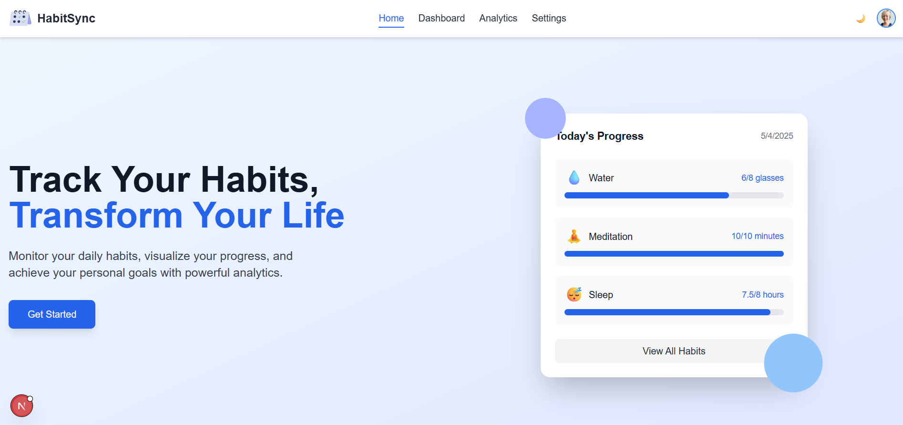
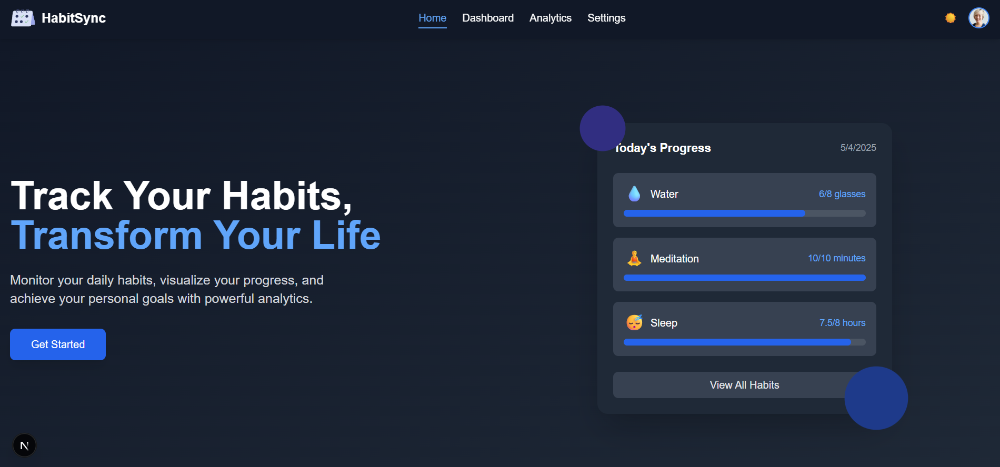
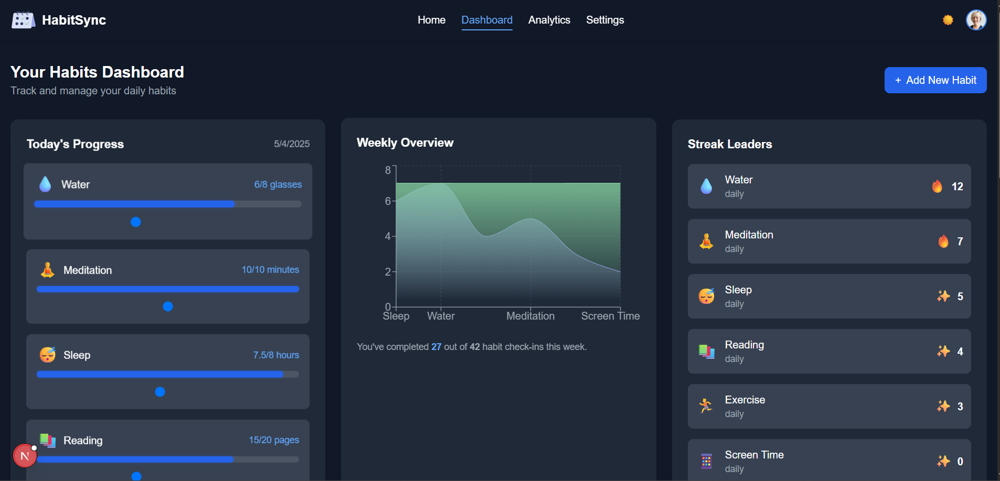
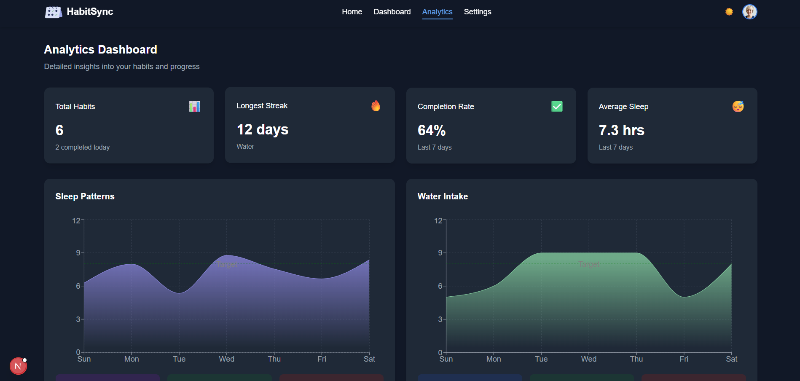
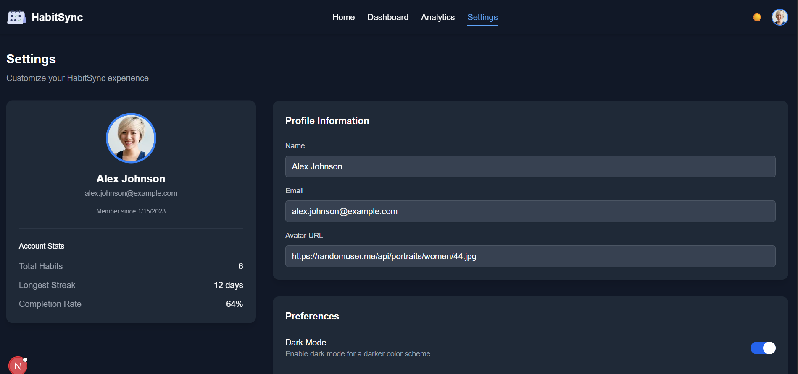

# HabitSync - Personal Analytics & Habit Tracker

## 📋 Overview

HabitSync is a powerful habit tracking application that helps users monitor daily habits and personal stats like sleep, water intake, and screen time. The app provides visual analytics through beautiful charts that show weekly progress, allows users to set daily goals, and sends reminders for missed activities. Users can check in or log activities daily and view their current streaks and performance trends.

## ✨ Features

### Core Features
- **📊 Visual Analytics:** Track your progress with beautiful charts and visualizations
- **✅ Daily Check-ins:** Log your daily habits with intuitive goal sliders
- **🔥 Streak Tracking:** Stay motivated with streak counters showing consistency
- **🔔 Smart Reminders:** Receive customizable notifications to stay on track

### Habit Categories
- 💧 **Water Intake:** Track daily hydration goals
- 😴 **Sleep Quality:** Monitor sleep patterns and improve rest
- 🧘 **Meditation:** Build mindfulness through consistent practice
- 📱 **Screen Time:** Reduce digital distractions
- 🏃 **Exercise:** Track physical activity and workout routines
- 📚 **Reading:** Monitor reading habits and progress

## 🏗️ Project Structure

The application includes the following main sections:

1. **Home:** Landing page with app introduction and key features
2. **Dashboard:** Central hub for tracking daily habits and viewing weekly overviews
3. **Analytics:** Detailed insights with advanced visualizations and correlation analysis
4. **Settings:** User profile management and application preferences

## 📱 UI Components

### Screenshots

#### Light Mode

*Home page in light mode*

#### Dark Mode

*Application in dark mode*

#### Dashboard

*Main dashboard with habit tracking*

#### Analytics

*Detailed analytics and data visualization*

#### Settings

*User settings and preferences*

### Home Page
- Hero section with call-to-action
- Feature highlights with icons
- Testimonials section
- Newsletter subscription

### Dashboard
- Today's progress trackers
- Weekly overview charts
- Streak leaders section
- Detailed habit table with progress indicators

### Analytics
- Key metrics summary (total habits, longest streak, completion rate)
- Individual habit analytics with trend charts
- Correlation analysis between habits
- Mood tracking visualization

### Settings
- User profile management
- Theme preferences (Dark/Night mode)
- Notification settings
- Account statistics

## 🙏 Acknowledgements

- [React](https://reactjs.org/)
- [Chart.js](https://www.chartjs.org/)
- [TailwindCSS](https://tailwindcss.com/)
- [React Icons](https://react-icons.github.io/react-icons/)
